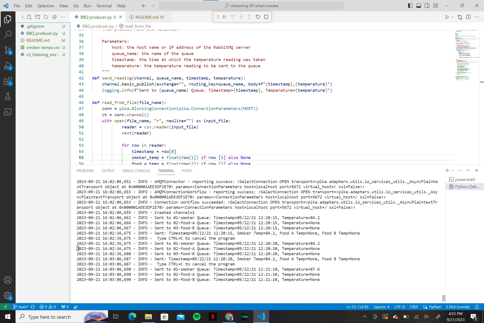
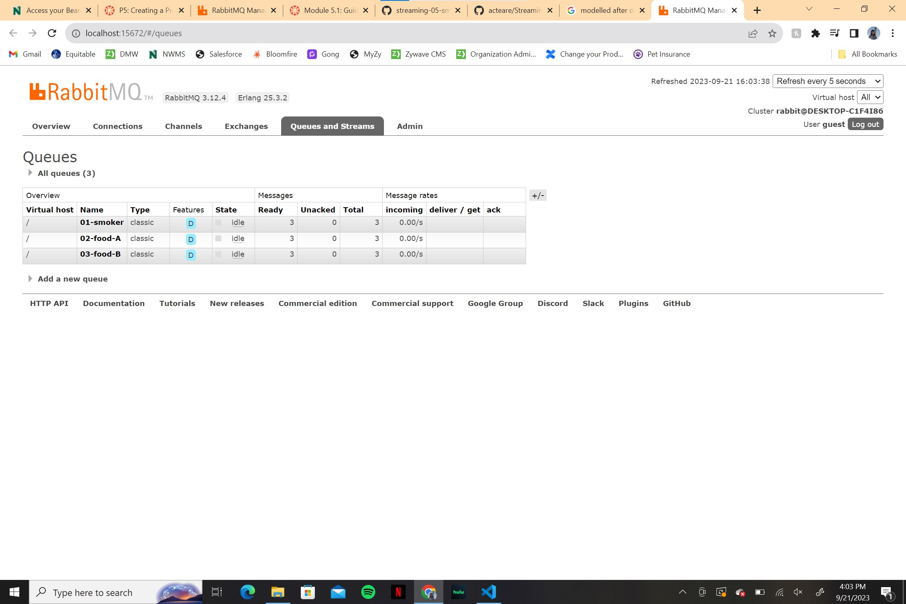

# streaming-05-smart-smoker
> Use RabbitMQ to distribute temperature readings to different worker channels. 

## Pre-requisites
Make sure the following are installed on your system:
1. pika
1. sys
1. webbrowser
1. time
1. logging

## Before You Begin
Make sure you are in your conda environment. Ensure pika is installed and updated with the following code: 

        conda install -c conda-forge pika

## Producer Notes/Comments
This project was built after v3_emitter_of_tasks.py from module 4. A copy was made and adjusted to meet the needs of the problem on hand. 

After listing imports and main variables, the individual programs were defined. 

1. "def Rabbit_admin()" was used in place of the original program called to open the RabbitMQ admin site.
1. "def send_reading()" is used to create and send the temperature reading to the queue during each execution
1. "def read_from_file()" is used to read data from a pre-determined file. The chosen file must be listed next to the "FILE_NAME_TASKS" variable. This program also makes sure each piece of data goes to the correct channel and tells the program to read one value every 30 seconds. 
1. "def main()" is used to bring all the defined programs under one main function. 

The python idiom was then used to ensure the functions were only called if this is actually the program being executed. In this case, the two functions being called are:
1. Rabbit_admin()
1. main()

Due to the 30 second time limit between readings, a user may hit CTRL-C to cancel the program at anytime. 

The picture below will show what an active terminal will look like when this program is running:

The picture below will show what the RabbitMQ admin site will look like when this program is running:

